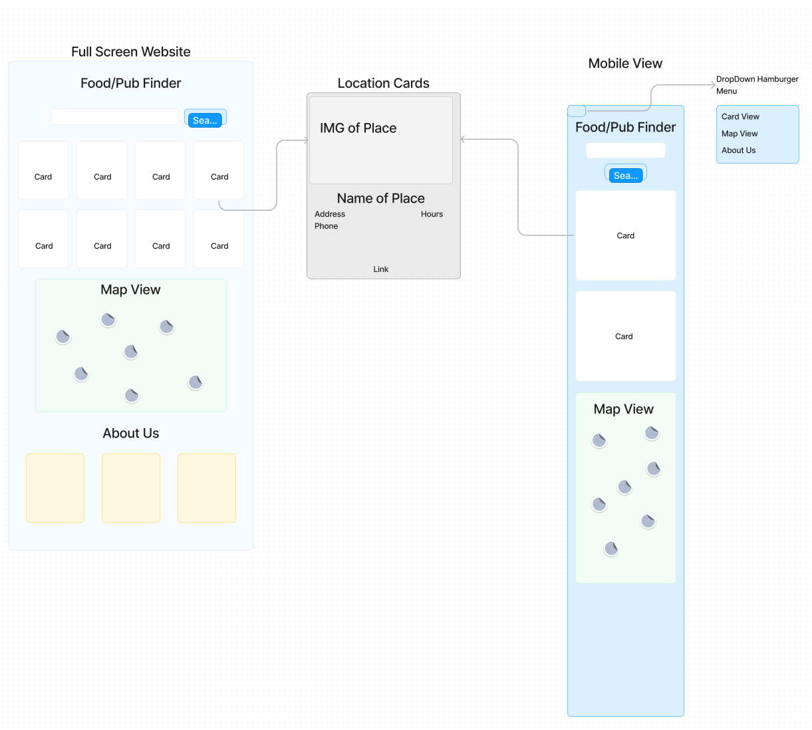

# TLG HTML/CSS/JS Final Project

## Restaurant/Pub Finder

### Table of Contents

1. [Team Members](#Team_7_Members)
2. [Project Description](#Project-Description)
3. [Flow Diagram](#Flow-Diagram)
4. [User Stories](#User-Stories)
5. [Product Demo](#Product-Demo)
6. [Technologies Used](#Technologies-Used)
7. [Lessons Learned](#lessons_learned)

### <a name="Team_7_Members">Team 7 Members</a>

- Alex Aguilar
- Ethan Wang
- Joseph Racke

### <a name="Project-Description">Project Description</a>

The Restaurant/Pub Finder App lets you find open Restaurants/Pubs near you, using your location and a search word (i.e. sushi or beer). If you do not want share your location that is ok, you can enter you city or zip code. After entering your search criteria and submitting. The Restaurant/Pub Finder App will display open Restaurants/Pubs and it's business information. All of the open Restaurants/Pubs will be placed on a map centered on your location.

### <a name="Flow-Diagram">Flow Diagram</a>

### <a name="User-Stories">User Stories</a>

- As a user I am able to share/not share my location.
  - If I dont share my location, I can type my zip code or address.
- As a user I can select what I want to search for.
- As a user I can set a radius of how far I want to go.
- As a user I want to see “open” locations with basic information(address, phone #).
- As a user I want to see the location based on my current location.(If I shared my location).

### <a name="Product-Demo">Product Demo</a>

- [Restaurant Finder](https://JMRacke.github.io)

### <a name="Technologies-Used">Technologies Used</a>

- HTML/CSS/JS
- VS Code
- GitHub
- Figma
- Heroku

### <a name="lessons_learned">Lessons Learned</a>

- Joe

  - Google Javascript API
  - Google Places API
  - Using a proxy server to hide API-Keys

- Alex

  - TODO

- Ethan
  - TODO
